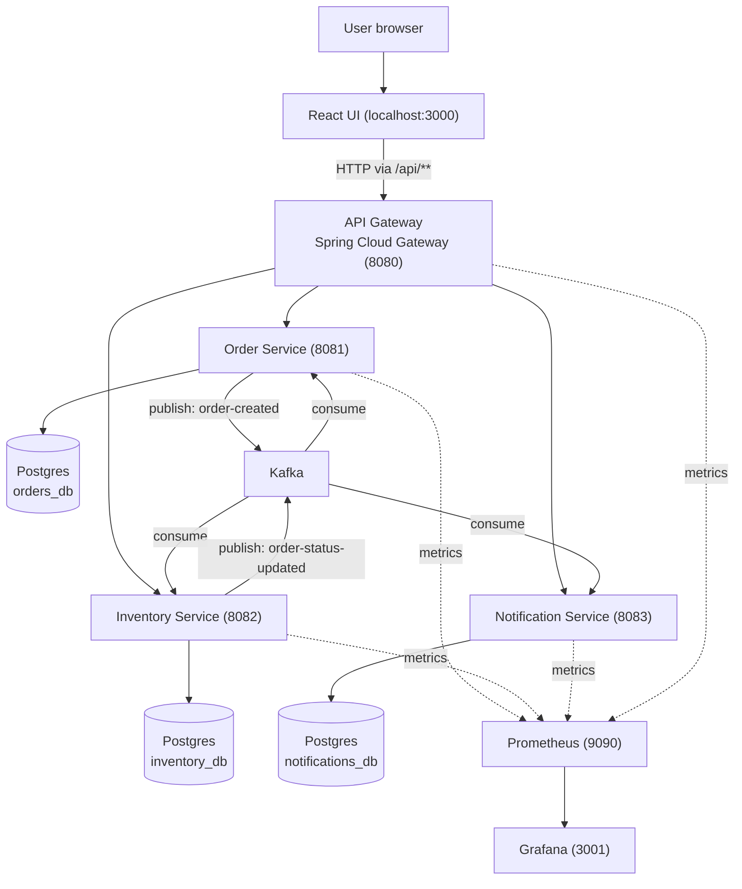
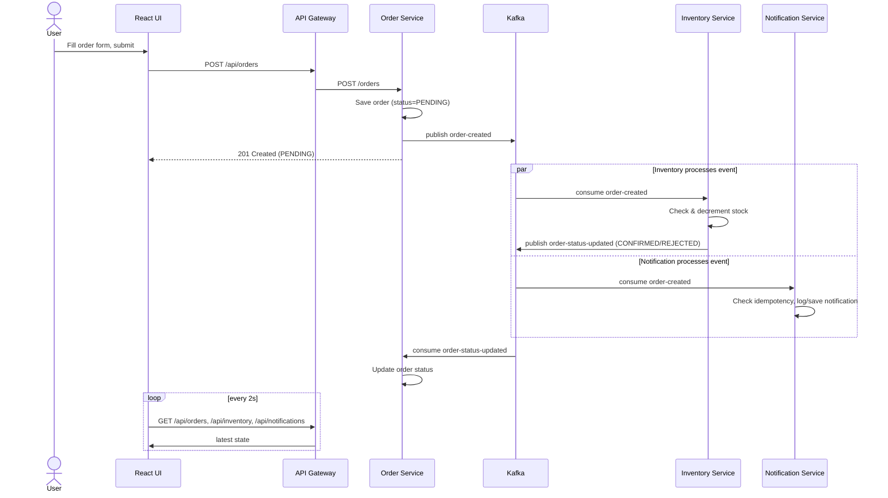

# Order Processing Microservices Platform

A locally runnable, event-driven microservices platform built with **Spring Boot**, **Apache Kafka**, **PostgreSQL**, and a **React** frontend, with **Prometheus + Grafana** observability. Everything runs on your machine via Docker Compose at **zero cost**, no cloud account, no billing, no deployment required.

This project demonstrates: independent microservices with database-per-service, asynchronous event-driven communication, resilience patterns, and basic observability, the core concepts behind production distributed systems, scoped down to something you can run on a laptop.

---

## 1. What this project does

A customer places an order through a React UI. The request flows through an API gateway to an Order Service, which saves the order and publishes an event to Kafka. Two independent services, Inventory and Notification, consume that event in parallel: Inventory checks and decrements stock (confirming or rejecting the order), and Notification simulates sending a confirmation message. The order's status updates asynchronously, and the UI reflects it within a couple of seconds via polling.

---

## 2. Architecture overview



**Key design points:**
- Each service is an independently deployable Spring Boot application with its own database. No service ever queries another service's tables directly.
- Order Service is the only synchronous entry point for writes; Inventory and Notification react to events asynchronously.
- The gateway is the single entry point for the frontend, so the UI never needs to know individual service ports.

---

## 3. End-to-end request flow



**Why this matters for the design:** Inventory and Notification consume the *same* event independently, one being slow or down does not block the other, and Order Service never calls either of them directly. This is what makes the system loosely coupled and resilient rather than a disguised monolith.

---

## 4. Components

| Component | Technology | Role |
|---|---|---|
| **React UI** | React 18, Vite, Axios | Order form, live order list, inventory view, notification feed. Polls the gateway every 2s. Not a production frontend, kept intentionally thin so review focus stays on the backend. |
| **API Gateway** | Spring Cloud Gateway | Single entry point on port 8080. Routes `/api/orders/**`, `/api/inventory/**`, `/api/notifications/**` to the respective service and handles CORS centrally. |
| **Order Service** | Spring Boot, Spring Data JPA, Spring Kafka | Owns order lifecycle. Validates requests, persists orders, publishes `order-created`, consumes `order-status-updated` to update order state. |
| **Inventory Service** | Spring Boot, Spring Data JPA, Spring Kafka | Owns product stock. Consumes `order-created`, decrements stock with optimistic locking, publishes `order-status-updated` (CONFIRMED or REJECTED). |
| **Notification Service** | Spring Boot, Spring Data JPA, Spring Kafka | Consumes `order-created`, simulates sending a confirmation (logs + persists), with an idempotency check against Kafka's at-least-once redelivery. |
| **PostgreSQL** | Postgres 16 (single container, 3 logical databases) | One database per service: `orders_db`, `inventory_db`, `notifications_db`. No cross-service table access. |
| **Kafka** | Bitnami Kafka (KRaft mode, no Zookeeper needed) | Event backbone. Topics: `order-created`, `order-status-updated`. |
| **Prometheus** | Prometheus | Scrapes `/actuator/prometheus` from all four Spring Boot apps every 5s. |
| **Grafana** | Grafana | Pre-provisioned dashboard showing request rate, JVM memory, error rate, and p99 latency per service. |
| **Resilience4j** | Library inside Order Service | Circuit breaker + retry config present for service-to-service calls (extend as needed if you add synchronous calls between services). |

---

## 5. Repository structure

```
microservices-order-platform/
├── docker-compose.yml
├── init-db/
│   └── init-databases.sql        # creates orders_db, inventory_db, notifications_db
├── order-service/                # Spring Boot, port 8081
├── inventory-service/            # Spring Boot, port 8082
├── notification-service/         # Spring Boot, port 8083
├── gateway/                       # Spring Cloud Gateway, port 8080
├── frontend/                      # React + Vite, port 3000
└── monitoring/
    ├── prometheus.yml
    └── grafana/
        ├── provisioning/          # auto-connects Grafana to Prometheus on startup
        └── dashboards/            # pre-built dashboard JSON
```

---

## 6. Prerequisites

- **Docker Desktop** (or Docker Engine + Docker Compose), this is the only hard requirement to run everything with one command
- Optional, only if you want to run a service outside Docker for development: **Java 17**, **Maven 3.9+**, **Node.js 20+**

No cloud account, no API keys, no paid services anywhere in this stack.

---

## 7. Local setup, run everything with one command

```bash
git clone <your-fork-url>
cd microservices-order-platform
docker-compose up --build
```

First run will take a few minutes (Maven dependency downloads + npm install happen inside the build). Subsequent runs are much faster since Docker caches layers.

**Wait for these log lines before testing** (Postgres and Kafka must be healthy before the services finish starting):
```
postgres   | database system is ready to accept connections
kafka      | [KafkaServer id=0] started
order-service | Started OrderServiceApplication
```

### Verify everything is up

| Service | URL | Expected |
|---|---|---|
| React UI | http://localhost:3000 | Order form + live panels |
| API Gateway | http://localhost:8080/actuator/health | `{"status":"UP"}` |
| Order Service | http://localhost:8081/actuator/health | `{"status":"UP"}` |
| Inventory Service | http://localhost:8082/actuator/health | `{"status":"UP"}` |
| Notification Service | http://localhost:8083/actuator/health | `{"status":"UP"}` |
| Prometheus | http://localhost:9090 | Prometheus UI, check Status → Targets, all 4 should be "UP" |
| Grafana | http://localhost:3001 | Login `admin` / `admin`, open "Order Platform Overview" dashboard |

### Try the flow

1. Open http://localhost:3000
2. Place an order for `SKU-001`, quantity 2, any customer name
3. Watch the **Orders** panel: status starts `PENDING`, flips to `CONFIRMED` within ~1-2 seconds
4. Watch the **Inventory** panel: stock for `SKU-001` drops by 2
5. Watch the **Notification feed**: a new message appears
6. Try ordering quantity 1000 of any product to see the `REJECTED` path (insufficient stock)

### Stopping everything

```bash
docker-compose down          # stop containers, keep data
docker-compose down -v       # stop containers and wipe the Postgres volume (fresh start)
```

---

## 8. Running services individually (development mode)

Useful if you're actively editing one service and want fast reload instead of rebuilding the Docker image each time.

```bash
# Start only the infra (Postgres + Kafka) via Docker
docker-compose up postgres kafka

# Run a service locally with Maven, pointing at the Dockerized infra
cd order-service
mvn spring-boot:run

# Run the frontend locally
cd frontend
npm install
npm run dev
```

When running a service locally instead of in Docker, its `application.yml` already defaults `DB_HOST` and `KAFKA_BROKER` to `localhost`, so no config changes are needed as long as the Postgres/Kafka ports (5432, 9092) are exposed to your host, which they are in `docker-compose.yml`.

---

## 9. Design notes and tradeoffs

- **Database-per-service, single container for cost reasons.** All three databases live in one Postgres container locally (`init-db/init-databases.sql` creates them), but each service connects only to its own database and never queries another's tables. In a cloud deployment, these would typically be three separate managed instances, the logical separation is what matters, not the physical container count.
- **Eventual consistency, not distributed transactions.** Order status is `PENDING` immediately after creation and updates asynchronously once Inventory processes the event. This avoids a distributed transaction across two services' databases, at the cost of a brief window where the order isn't yet confirmed. This is the standard tradeoff event-driven systems make (sometimes addressed with the Saga pattern for more complex multi-step workflows).
- **At-least-once delivery and idempotency.** Kafka can redeliver messages. Notification Service explicitly checks whether it has already recorded a notification for a given order ID before sending another, without this, a redelivered message would cause a duplicate notification.
- **Optimistic locking on stock.** `Product` uses `@Version` so concurrent stock decrements under load fail fast and retry, rather than silently overwriting each other's updates.
- **Resilience4j is wired into Order Service** for synchronous calls to other services (circuit breaker + retry config in `application.yml`). The current flow is fully event-driven and doesn't require a synchronous call, so this is included to demonstrate the pattern, it's exercised if you extend Order Service to call Inventory Service directly for a real-time stock check before accepting an order.
- **React UI is intentionally thin.** It exists to demonstrate the distributed flow visually (place an order, watch inventory drop and a notification appear), not as a frontend engineering showcase.

---

## 10. Possible extensions

- Add Spring Cloud Config or Consul for centralized configuration / service discovery
- Replace polling in the UI with Server-Sent Events or WebSockets for real push updates
- Add a dead-letter topic for failed Kafka consumption
- Add Testcontainers-based integration tests that spin up real Postgres + Kafka in CI (dependencies are already included in `order-service/pom.xml`)
- Add a GitHub Actions workflow that runs `mvn test` and builds Docker images on every push

---

## 11. License

MIT, use freely for learning.
